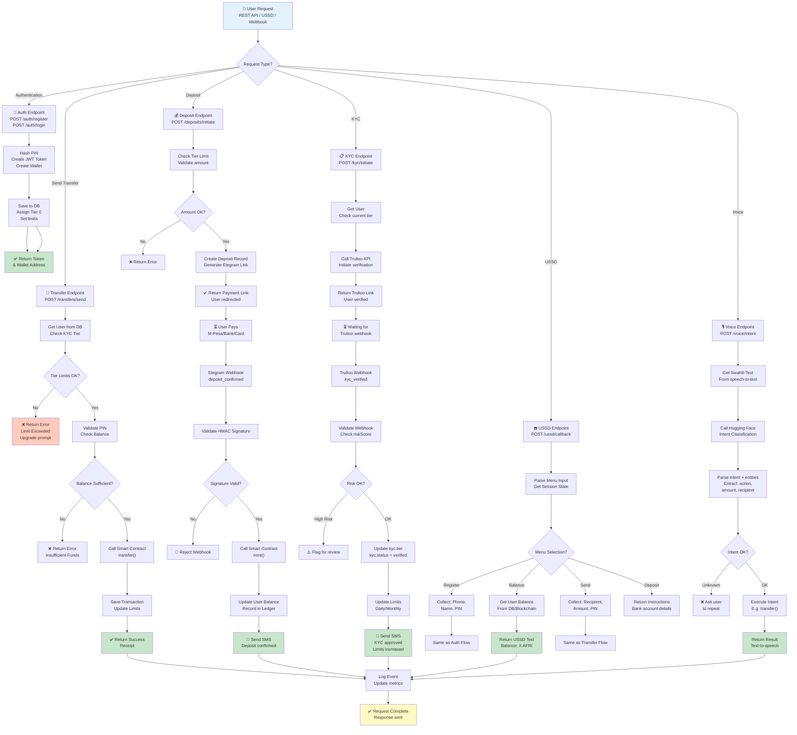
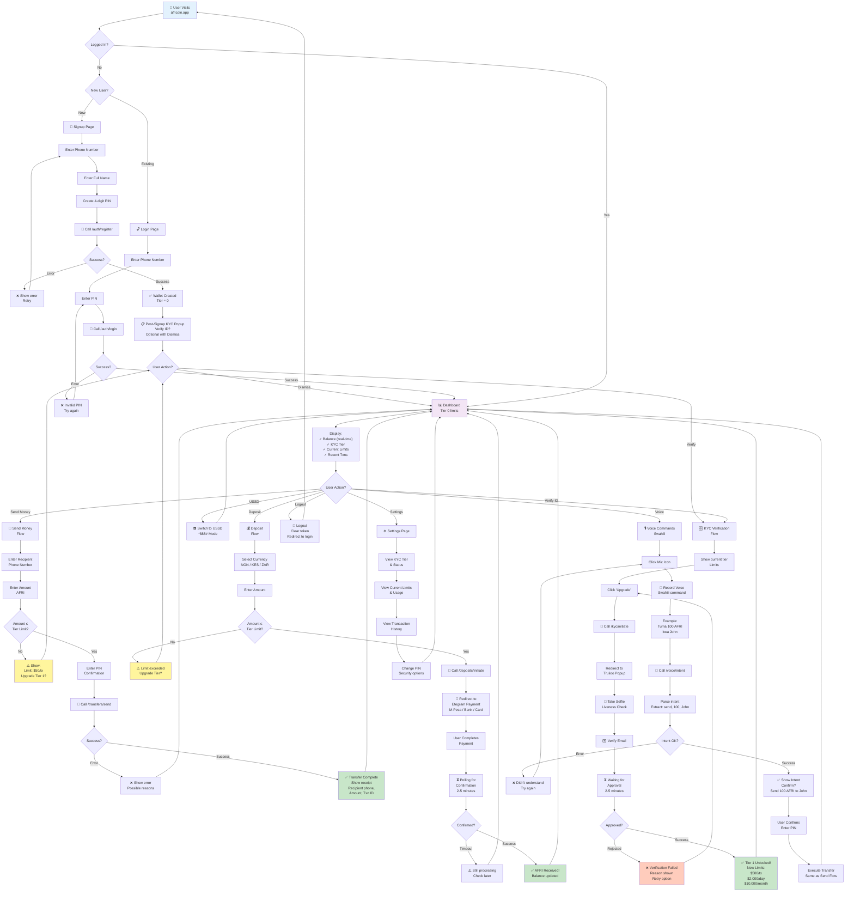
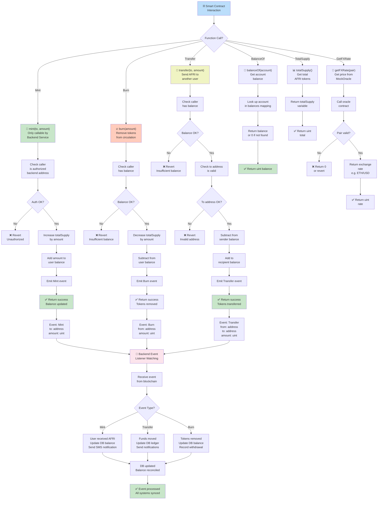
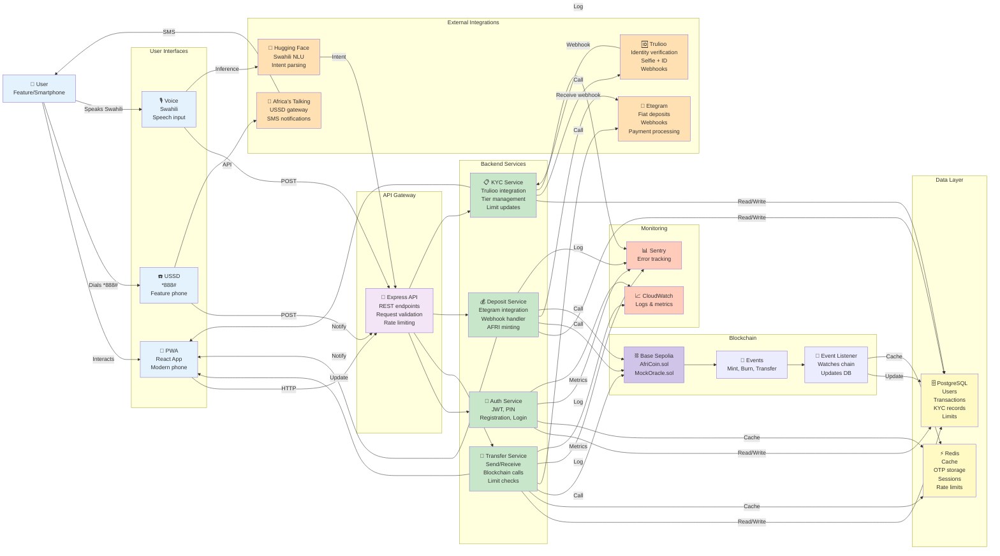

# AfriCoin Application Flow Diagrams (Flowcharts)

This document contains Mermaid flowchart diagrams for all major application flows.

---

## 1. Backend Application Flow

---

## 2. Frontend Application Flow

---

## 3. Smart Contract Flow

---

## 4. Complete Application Flow (End-to-End)

---

## Flow Legend

| Symbol | Meaning |
|--------|---------|
| 👤 | User/Person |
| 📱 | Mobile/Frontend |
| 🔌 | API/Gateway |
| 🔐 | Security/Auth |
| 💸 | Transfers/Payments |
| 💰 | Deposits/Money in |
| 📋 | KYC/Compliance |
| ☎️ | Phone/USSD |
| 🎙️ | Voice/Audio |
| 🗄️ | Database |
| ⚡ | Cache/Redis |
| ⛓️ | Blockchain |
| 🔔 | Events/Webhooks |
| 🏦 | Financial Integration |
| 🆔 | Identity/Verification |
| 📲 | Messaging |
| 🤖 | AI/ML |
| 📊 | Monitoring |

---

## Usage Guide

### For Developers
- **Backend Flow:** Understand request handling, validation, and business logic
- **Frontend Flow:** Track user journey, UI states, and navigation
- **Smart Contract Flow:** Know how blockchain operations work
- **Complete Flow:** See how all systems interact end-to-end

### For Stakeholders
- **Complete Flow:** Shows the full system architecture and integrations
- **Frontend Flow:** Demonstrates user experience
- **Data Flow:** Understand how information moves through the system

### For Debugging
- **Backend Flow:** Trace request through services
- **Smart Contract Flow:** Check on-chain transaction processing
- **Complete Flow:** Identify where integration breaks occur

---

**Last Updated:** December 14, 2025  
**Status:** Reference Documentation  
**Format:** Mermaid Flowcharts (compatible with GitHub, Notion, Confluence)
