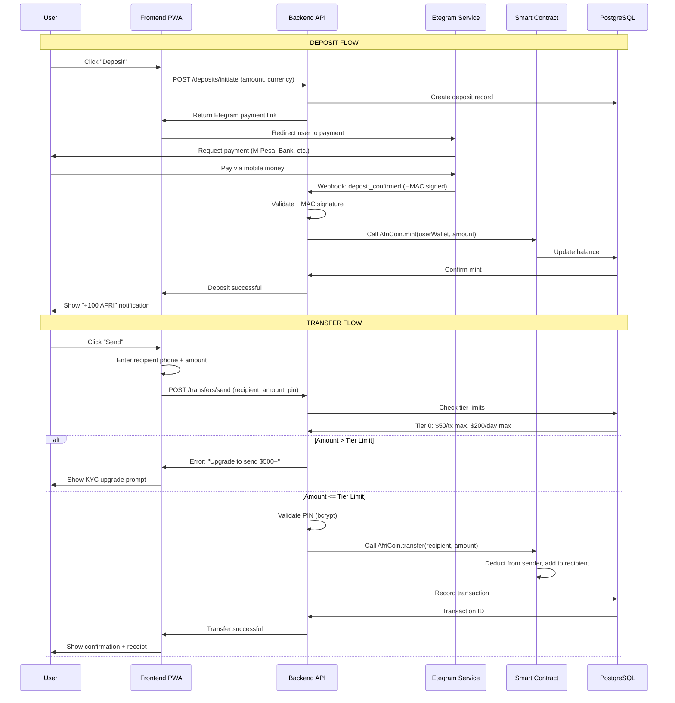
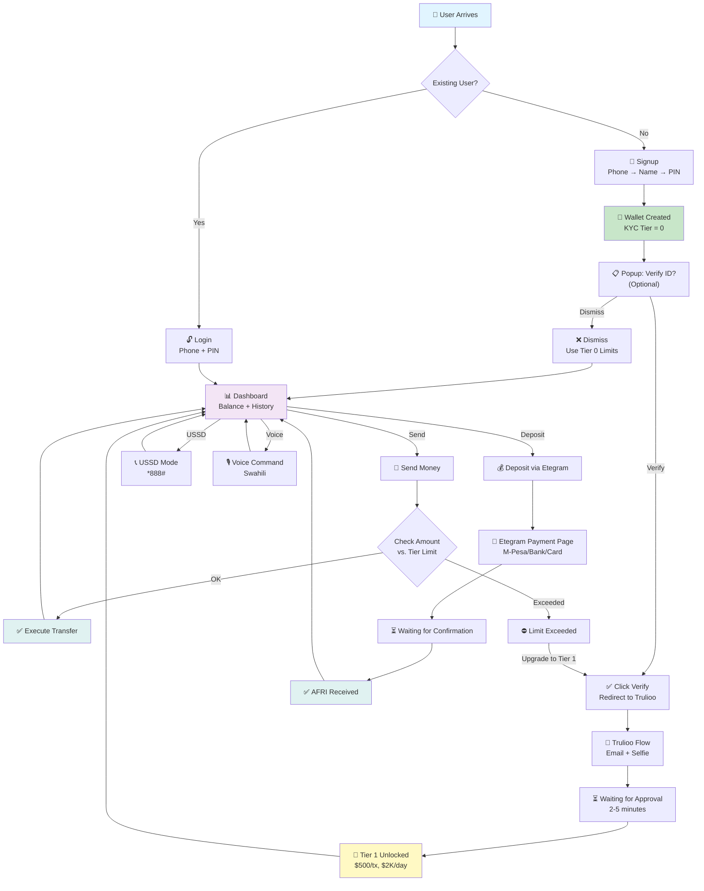
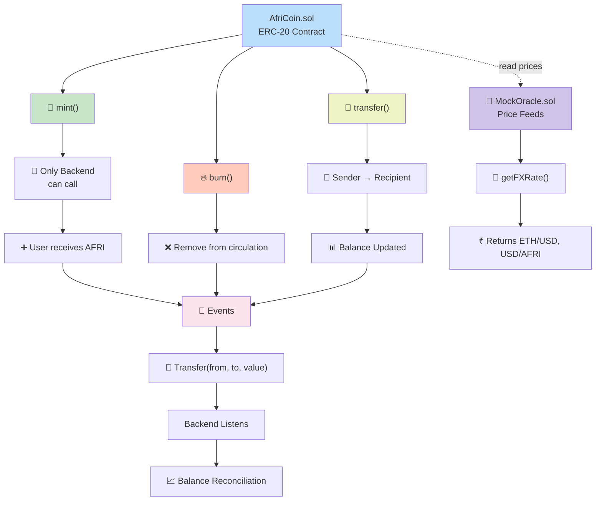
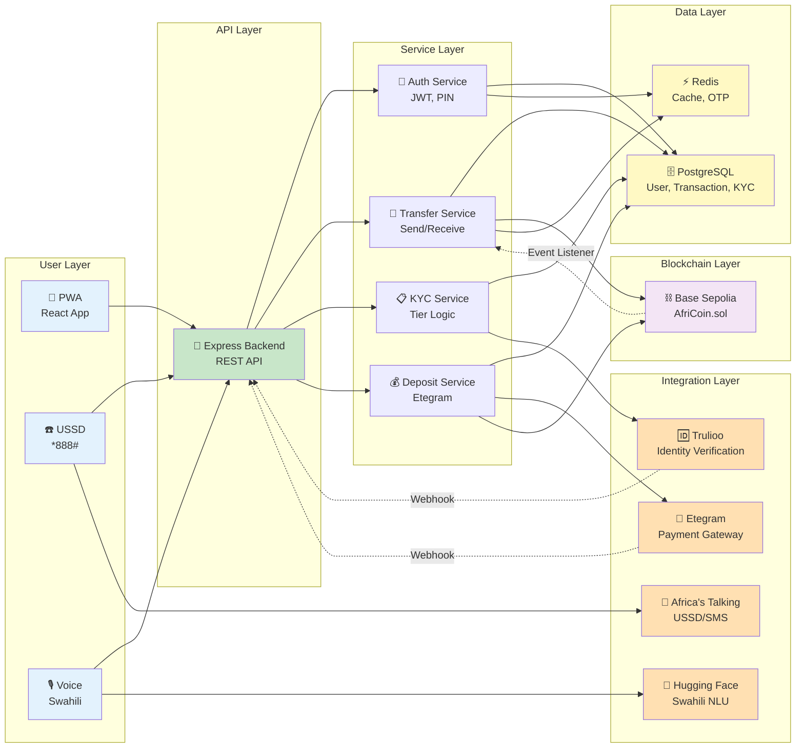

# AfriCoin Production-Ready MVP Plan

**Status:** Ready for Implementation  
**Timeline:** 8–9 weeks (5 weeks compressed with parallel phases)  
**Target:** Launch before hackathon submission  
**Philosophy:** No mocking—all real integrations (sandbox environment for testing)

---

## Table of Contents

1. [Executive Summary](#executive-summary)
2. [KYC Tier Structure & Limits](#kyc-tier-structure--limits)
3. [Architecture Overview](#architecture-overview)
4. [Implementation Timeline](#implementation-timeline)
5. [Phase Breakdown](#phase-breakdown)
6. [What's Included vs. Excluded](#whats-included-vs-excluded)
7. [Architecture Diagrams](#architecture-diagrams)
8. [Deployment & Launch](#deployment--launch)
9. [Success Metrics](#success-metrics)

---

## Executive Summary

AfriCoin is transitioning from a hackathon MVP concept to a **production-ready fintech platform**. This plan outlines a real implementation (no mocks) leveraging:

- **Real Blockchain:** Base Sepolia testnet → Base mainnet post-launch
- **Real Payment Gateway:** Etegram sandbox (deposits) + production (post-MVP)
- **Real KYC:** Trulioo sandbox (identity verification)
- **Real Messaging:** Africa's Talking sandbox (USSD, SMS)
- **Real LLM:** Hugging Face API (Swahili intent parsing)

**Deliverable:** A fully functional, investor-ready MVP that processes real transactions with tiered KYC compliance.

---

## KYC Tier Structure & Limits

### Tier Definitions

AfriCoin enforces transaction limits based on KYC verification status. This balances **user experience**, **regulatory compliance**, and **fraud prevention**.

#### Tier 0: Unverified (Phone Only)

| Metric | Value |
|--------|-------|
| **Requirements** | Phone number only |
| **Verification Time** | Instant |
| **Per-Transaction Limit** | $50 USD |
| **Daily Limit** | $200 USD |
| **Monthly Limit** | $1,000 USD |
| **Use Case** | Quick peer-to-peer transfers, testing the platform |
| **KYC Status** | `kyc.tier = 0, kyc.status = "unverified"` |

**User Experience:**
- Signup complete immediately
- Post-signup popup: "Verify ID to unlock higher limits (optional)"
- Can dismiss and use Tier 0 limits
- Send/receive with $50 max per transaction
- After 5 days or hitting monthly limit, prompted to upgrade

#### Tier 1: Basic KYC (Phone + Email + Selfie)

| Metric | Value |
|--------|-------|
| **Requirements** | Email verification + selfie (liveness check) |
| **Verification Time** | 3–7 minutes (Trulioo automated) |
| **Per-Transaction Limit** | $500 USD |
| **Daily Limit** | $2,000 USD |
| **Monthly Limit** | $10,000 USD |
| **Use Case** | Regular traders, small business owners, remittance senders |
| **KYC Status** | `kyc.tier = 1, kyc.status = "verified"` |

**User Experience:**
- Click "Upgrade to Tier 1"
- Verify email (30 seconds)
- Record selfie (1–2 minutes)
- Trulioo processes (2–5 minutes)
- Auto-upgrade on approval
- SMS notification: "Tier 1 verified! Limits increased to $500/tx"

#### Tier 2: Full KYC (ID + Address + Income Verification)

| Metric | Value |
|--------|-------|
| **Requirements** | Government ID + proof of address + income verification |
| **Verification Time** | 15–90 minutes (mostly Trulioo AI; some manual review) |
| **Per-Transaction Limit** | $5,000 USD |
| **Daily Limit** | $20,000 USD |
| **Monthly Limit** | $100,000 USD |
| **Use Case** | Merchants, traders, import/export businesses, enterprises |
| **KYC Status** | `kyc.tier = 2, kyc.status = "verified"` |

**User Experience:**
- Click "Upgrade to Tier 2"
- Upload government ID (passport, national ID)
- Provide address (utility bill/lease agreement)
- [Optional] Income verification (bank statement)
- Trulioo processes with AI + manual review if flagged
- Email notification when approved
- Access to all features, unlimited transactions (soft caps: $20K/day is operational, not hard limit)

### Regulatory Alignment

These limits are calibrated for **African fintech standards**:

| Platform | Unverified Limit | Verified Limit | Notes |
|----------|-----------------|----------------|-------|
| **M-Pesa (Kenya)** | ~$50 | ~$1,000 | Officially regulated |
| **Paystack** | $100 | Unlimited | After email |
| **Flutterwave** | $100–500 | Unlimited | After KYC |
| **Wise/TransferWise** | $100–500 | Unlimited | After KYC |
| **AfriCoin (This Plan)** | $50 | $500–$5,000 | Tiered approach |

---

## Architecture Overview

### System Components

```
┌─────────────────────────────────────────────────────────┐
│                    USER APPLICATIONS                     │
├─────────────────┬─────────────────────┬─────────────────┤
│   PWA (React)   │   USSD (Feature     │  Voice Commands │
│   Web Browser   │   Phone)            │  (Swahili)      │
└────────┬────────┴────────┬────────────┴────────┬────────┘
         │                 │                     │
         └─────────────────┼─────────────────────┘
                           │
                    ┌──────▼──────┐
                    │   BACKEND   │ ← Core API server
                    │  (Express)  │
                    └──────┬──────┘
                           │
        ┌──────────────────┼──────────────────┐
        │                  │                  │
    ┌───▼────┐      ┌──────▼─────┐    ┌──────▼──────┐
    │PostgreSQL      │ Redis      │    │ Message Q   │
    │Database        │ Cache/OTP  │    │ (Bull/Redis)│
    └───┬────┘      └────────────┘    └─────────────┘
        │
        │ Reads/Writes User, Transaction, KYC data
        │
    ┌───▼───────────────────────┐
    │  Smart Contracts          │
    │  (Base Sepolia/Mainnet)   │
    │  - AfriCoin.sol (ERC-20)  │
    │  - MockOracle.sol         │
    └───────────────────────────┘
        │
    External Integrations:
    ├─ Etegram API (deposits)
    ├─ Trulioo API (KYC verification)
    ├─ Africa's Talking (USSD, SMS)
    ├─ Hugging Face (Swahili NLU)
    └─ Base Blockchain RPC
```

### Database Schema (User Model with KYC)

```typescript
// Relevant fields for KYC tier system
interface User {
  // Identity
  phoneHash: string;          // SHA-256(phone) - privacy
  phone: string;              // Encrypted
  name: string;
  email?: string;
  
  // Wallet
  walletAddress: string;      // User's AFRI wallet
  depositWalletAddress?: string; // For incoming fiat
  
  // KYC
  kyc: {
    tier: 0 | 1 | 2;          // Current tier
    status: "unverified" | "verified" | "rejected" | "suspended";
    provider?: "trulioo" | "onfido";
    verifiedAt?: Date;
    expiryDate?: Date;         // KYC valid 1 year
    riskScore?: number;        // 0-100 (Trulioo)
  };
  
  // Limits (auto-set based on tier)
  limits: {
    tier: {
      txLimit: number;        // $50, $500, or $5,000
      dailyLimit: number;     // $200, $2,000, or $20,000
      monthlyLimit: number;   // $1,000, $10,000, or $100,000
    };
    daily: {
      used: number;           // Cumulative today
      resetAt: Date;          // Resets at UTC midnight
    };
    monthly: {
      used: number;           // Cumulative this month
      resetAt: Date;          // Resets on 1st of month
    };
  };
  
  // Status
  status: "active" | "suspended" | "deleted";
  suspensionReason?: string;
  
  // Timestamps
  createdAt: Date;
  updatedAt: Date;
}
```

---

## Implementation Timeline

### 8-Week Realistic Timeline (40 working days)

| Phase | Duration | Deliverable |
|-------|----------|-------------|
| **0: Setup** | 3 days | Infrastructure + environment ready |
| **1a: Contracts** | 5 days | Smart contracts deployed to Base Sepolia |
| **1b: Backend APIs** | 5–6 days | User registration, balance queries, auth |
| **2a: Deposits** | 5–7 days | Etegram sandbox integration working |
| **2b: KYC Tiers** | 4–5 days | Tier system with Trulioo sandbox |
| **2c: Transfers** | 4–5 days | On-chain send/receive functionality |
| **3: USSD** | 3–4 days | Africa's Talking sandbox working |
| **4: Frontend** | 10–12 days | Complete PWA + onboarding |
| **5: Voice/LLM** | 5–7 days | Swahili intent parsing |
| **6: Testing** | 5–7 days | QA, hardening, deployment |
| **TOTAL** | **49–61 days** | **Production MVP ready** |

### 5-Week Compressed Timeline (35 days)

Parallelize phases 3 & 4 (USSD + Frontend simultaneously):
- Week 1: Phases 0 → 1a → 1b
- Week 2: Phases 2a → 2b → 2c
- Week 3: Phases 3 + 4 (parallel)
- Week 4: Phase 5 (voice)
- Week 5: Phase 6 (testing + deploy)

**Savings:** ~2 weeks by overlapping independent tasks

---

## Phase Breakdown

### Phase 0: Environment & Infrastructure (3 days)

**Objective:** Establish development infrastructure

**Tasks:**
- [ ] Configure PostgreSQL (local + cloud staging)
- [ ] Setup Redis (for OTP, session caching)
- [ ] Create `.env` files (secrets, API keys)
- [ ] Verify pnpm workspaces + Turborepo
- [ ] Docker Compose for reproducibility
- [ ] GitHub Actions CI/CD pipeline (optional for MVP)

**Deliverable:** `docker-compose up` brings entire dev stack online

**Effort:** 3 days

---

### Phase 1a: Smart Contracts (5 days)

**Objective:** Deploy contracts to Base Sepolia; remove DAO

**Tasks:**
- [ ] Delete files:
  - `packages/base-blockchain/contracts/AfriDAO.sol`
  - `packages/base-blockchain/contracts/AfriVoting.sol`
  - `packages/base-blockchain/test/AfriDAO.test.ts`
  - `packages/base-blockchain/test/AfriVoting.test.ts`
- [ ] Update `packages/base-blockchain/scripts/deploy.ts`:
  - Remove DAO deployment
  - Keep `AfriCoin.sol` (ERC-20) + `MockOracle.sol`
- [ ] Deploy to Base Sepolia testnet
- [ ] Create test fixtures:
  - Mint 1M AFRI test tokens
  - Distribute to test accounts
- [ ] Verify on Basescan

**Deliverable:** Contracts live; Base Sepolia confirmed on Basescan

**Effort:** 5 days

---

### Phase 1b: Backend Core APIs (5–6 days)

**Objective:** User onboarding + wallet creation

**Tasks:**
- [ ] Migrate User model to Prisma + PostgreSQL
- [ ] Add KYC fields to schema (see schema above)
- [ ] Implement endpoints:
  - `POST /auth/register` (phone, name, 4-digit PIN) → create wallet
  - `POST /auth/login` (phone, PIN) → JWT token
  - `GET /wallet/balance` (returns user's balance)
  - `GET /kyc/status` (shows current tier + limits)
- [ ] Integrate Web3Auth MPC (non-custodial wallet)
- [ ] PIN hashing + verification (bcrypt)
- [ ] Error handling middleware

**Deliverable:** Full onboarding works; user has Sepolia wallet + KYC tier assigned

**Effort:** 5–6 days

---

### Phase 2a: Deposits (Etegram Sandbox) (5–7 days)

**Objective:** Real fiat → AFRI conversion

**Tasks:**
- [ ] Request Etegram sandbox credentials (contact founder)
- [ ] Create `apps/backend/src/services/etegram.ts`:
  - Authentication
  - Payment request creation (returns deposit address)
  - Webhook validation (HMAC-SHA256 signature)
  - Idempotency checks
- [ ] Add `POST /deposits/initiate`:
  - Returns unique Etegram payment link
  - User selects currency (NGN, KES, ZAR)
  - User selects amount
- [ ] Add `POST /deposits/webhook`:
  - Receives confirmation from Etegram
  - Validates signature
  - Calls `AfriCoin.mint()` smart contract
  - Updates user balance
- [ ] Error handling (failed deposits, retries)

**Deliverable:** Users can deposit fiat via Etegram sandbox → receive AFRI

**Effort:** 5–7 days

**Note:** Etegram sandbox approval can take 1–2 days; request early

---

### Phase 2b: KYC Tiering & Limits (4–5 days)

**Objective:** Tier system + transaction limit enforcement

**Tasks:**
- [ ] Update User model with tier limits (see schema)
- [ ] Create `TierService`:
  - `canPerformTransaction()` (check limits before transfer)
  - `recordTransaction()` (deduct from daily/monthly counters)
  - `resetDailyLimits()` (cron job at UTC midnight)
  - `resetMonthlyLimits()` (cron job on 1st of month)
- [ ] Integrate Trulioo sandbox:
  - `POST /kyc/initiate` (starts verification)
  - `GET /kyc/status` (polls verification status)
  - Webhook receiver for completion
- [ ] Update user tier on Trulioo approval
- [ ] Add UI modal: "Verify ID to unlock higher limits" (dismissible)
- [ ] Tier-based limit display in frontend

**Deliverable:** Transfers enforced by tier limits; users can self-verify

**Effort:** 4–5 days

**Tier Limits Reminder:**
- **Tier 0:** $50/tx, $200/day, $1,000/month
- **Tier 1:** $500/tx, $2,000/day, $10,000/month
- **Tier 2:** $5,000/tx, $20,000/day, $100,000/month

---

### Phase 2c: Send/Receive Transfers (4–5 days)

**Objective:** Real peer-to-peer on-chain transfers

**Tasks:**
- [ ] Update `apps/backend/src/services/transferService.ts`:
  - Check sender balance (on-chain)
  - Check KYC tier limits (via TierService)
  - Execute transfer via `AfriCoin.transfer()` contract
  - Record transaction in database
- [ ] Add `POST /transfers/send`:
  - Recipient phone → resolve wallet address
  - Amount → validate against limits
  - PIN confirmation
  - Execute transfer
- [ ] Listen to blockchain `Transfer` events
- [ ] Reconcile on-chain balance with DB
- [ ] Transaction history endpoint: `GET /transactions?limit=10`

**Deliverable:** Real peer-to-peer transfers on Base Sepolia

**Effort:** 4–5 days

---

### Phase 3: USSD (3–4 days, parallel with Phase 4)

**Objective:** Feature phone access

**Tasks:**
- [ ] Africa's Talking sandbox setup (free)
- [ ] Implement USSD state machine:
  ```
  Main Menu
  ├─ 1. Register (phone, name, PIN)
  ├─ 2. Check Balance
  ├─ 3. Send Money (recipient, amount, PIN)
  ├─ 4. Receive (display payment code)
  └─ 5. Deposit (instructions)
  ```
- [ ] Add `POST /ussd/callback`:
  - Parse user input (menu selection)
  - Execute business logic
  - Return formatted USSD response
- [ ] SMS notifications (real Africa's Talking SMS API)
- [ ] Error handling (invalid input, timeouts)

**Deliverable:** Users can dial *888# and use AFRI

**Effort:** 3–4 days

---

### Phase 4: Frontend PWA (10–12 days, parallel with Phase 3)

**Objective:** Modern web interface for smartphone users

**Tasks:**
- [ ] Setup React + Vite + Tailwind (already partially done)
- [ ] Onboarding:
  - Phone input → name → 4-digit PIN
  - Create wallet → get balance
- [ ] Post-signup KYC popup:
  - "Verify ID to unlock higher limits"
  - Dismiss button (optional)
  - "Verify Now" button (redirects to Trulioo)
- [ ] Dashboard:
  - Display balance (real-time from backend)
  - Recent transactions (last 10)
  - Account info (tier, limits, KYC status)
- [ ] Send Money page:
  - Recipient phone number
  - Amount (checks tier limits)
  - PIN confirmation
  - Success/error handling
- [ ] Deposit page:
  - Currency selector (NGN, KES, ZAR)
  - Amount input
  - "Deposit via Etegram" button
  - Redirect to Etegram payment
  - Polling for deposit confirmation
- [ ] Settings page:
  - KYC tier + status
  - Current limits + usage
  - Transaction history
  - Account security (change PIN)
- [ ] PWA features:
  - Manifest (installable app)
  - Service worker (offline support)
  - i18n (Swahili + English)

**Deliverable:** Complete web app; users can onboard, deposit, send, receive

**Effort:** 10–12 days

---

### Phase 5: Voice/LLM (5–7 days)

**Objective:** Swahili voice commands

**Tasks:**
- [ ] Hugging Face Inference API setup:
  - Free tier for prototyping
  - `zero-shot-classification` for intent parsing
- [ ] Train/configure for Swahili intents:
  - `send_money` — "Tuma 100 AFRI kwa John"
  - `check_balance` — "Jua salio langu"
  - `deposit` — "Taka kuagiza pesa"
  - `transaction_history` — "Historia ya miamala"
- [ ] Backend endpoint:
  - `POST /voice/intent` (receives Swahili text)
  - Returns structured intent + entities
- [ ] Frontend:
  - Web Speech API for voice input (browser-native)
  - Display parsed intent
  - Execute command with user confirmation
- [ ] Text-to-speech (optional):
  - Web Audio API or Google Cloud TTS
  - Read balance aloud in Swahili

**Deliverable:** Users can say "Tuma 100 AFRI kwa Juma" → execute transfer

**Effort:** 5–7 days

---

### Phase 6: Testing & Deployment (5–7 days)

**Objective:** Production-ready code + live deployment

**Tasks:**
- [ ] Unit tests:
  - User registration
  - Transfer execution
  - KYC tier enforcement
  - Deposit processing
- [ ] Integration tests:
  - Full flow: register → deposit → transfer → check balance
  - Error scenarios (insufficient balance, limit exceeded)
  - Webhook reliability (Etegram, Trulioo)
- [ ] Load testing:
  - 100+ concurrent users
  - Measure latency, resource usage
- [ ] Security audit:
  - OWASP Top 10 checks
  - JWT validation
  - Input sanitization
  - CORS configuration
  - Rate limiting
- [ ] Deployment:
  - Frontend: Vercel (automatic from GitHub)
  - Backend: Railway, Heroku, or DigitalOcean
  - Database: Supabase (managed PostgreSQL)
  - Monitoring: Sentry (error tracking)
- [ ] Documentation:
  - API docs (Swagger/OpenAPI)
  - KYC process flow
  - Deployment runbook
  - Troubleshooting guide

**Deliverable:** Production MVP deployed; all systems live and tested

**Effort:** 5–7 days

---

## What's Included vs. Excluded

### ✅ INCLUDED in MVP

| Feature | Why | Status |
|---------|-----|--------|
| Phone-based onboarding | Core identity model for Africa | ✅ Ready to build |
| Web3Auth MPC wallet | Non-custodial, no seed phrases | ✅ SDK available |
| Real transfers (on-chain) | Base Sepolia testnet | ✅ Ready to build |
| KYC tier system | Compliance + UX balance | ✅ Ready to build |
| Etegram deposits | Real fiat → crypto bridge | ⚠️ Sandbox setup needed |
| Trulioo KYC | Identity verification | ⚠️ Sandbox setup needed |
| USSD for feature phones | 80%+ of Africa uses feature phones | ✅ Africa's Talking ready |
| PWA for smartphones | Modern, installable web app | ✅ React + Vite ready |
| Swahili voice commands | AI-driven accessibility | ✅ Hugging Face ready |
| SMS notifications | Critical for fintech | ✅ Africa's Talking ready |

### ❌ EXCLUDED from MVP (Post-Launch)

| Feature | Reason | Timeline |
|---------|--------|----------|
| **Withdrawals** | Requires real Etegram bank account setup | Phase 2 (2–3 weeks post-MVP) |
| **DAO/Governance** | You're removing it; not MVP-critical | N/A |
| **Merchant Settlement** | Complex reconciliation; add with merchants | Phase 2 (4–6 weeks post-MVP) |
| **Multi-Sig Wallets** | Security feature; not for MVP | Phase 3 (post-first-1000-users) |
| **Analytics Dashboard** | Nice-to-have; non-critical | Phase 2 |
| **Advanced Stability Engine** | PID rebalancing; ship with mock data | Phase 2 (research + implementation) |
| **Cross-Chain Bridges** | Complex, low priority | Phase 3+ |

---

## Architecture Diagrams

### 1. Backend Flow (Deposit & Transfer)



### 2. Frontend Flow (User Journey)



### 3. Smart Contract Flow



### 4. Complete Application Flow (High Level)



---

## Deployment & Launch

### Pre-Launch Checklist

#### Security
- [ ] Secrets stored in vault (not code/env files)
- [ ] HTTPS enforced (TLS 1.3+)
- [ ] Rate limiting configured (100 req/min per user)
- [ ] CORS hardened (whitelist domains only)
- [ ] JWT expiry + refresh token rotation
- [ ] Password/PIN encryption (bcryptjs, rounds ≥ 12)
- [ ] Database encryption at rest
- [ ] PII encryption (phone, email, KYC docs)

#### Infrastructure
- [ ] Database backups automated (daily)
- [ ] Error tracking (Sentry)
- [ ] Uptime monitoring (Pingdom)
- [ ] Log aggregation (CloudWatch, ELK)
- [ ] Load testing passed (100+ concurrent users)
- [ ] Auto-scaling configured

#### Compliance
- [ ] Audit trail logging (all KYC, transactions)
- [ ] Transaction immutability enforced
- [ ] KYC tier limits enforced at DB level
- [ ] AML screening on high-value txns
- [ ] Terms of Service + Privacy Policy drafted
- [ ] Refund/dispute process documented

#### Testing
- [ ] Unit tests: ≥80% code coverage
- [ ] Integration tests: all flows working
- [ ] E2E tests: real user journeys
- [ ] Security audit: OWASP Top 10 passed
- [ ] Performance: P99 latency < 2s

### Deployment Steps

**Week 1: Staging Deployment**
1. Deploy backend to staging (Railway/Heroku)
2. Deploy frontend to staging (Vercel)
3. Run full test suite
4. Load test (1000+ concurrent users)
5. Penetration test (external security firm optional)

**Week 2: Production Deployment**
1. Deploy smart contracts to Base mainnet (or keep Sepolia for MVP)
2. Setup production database (Supabase)
3. Configure Etegram production account
4. Whitelist production domain in CORS
5. Enable monitoring + alerting
6. Create runbook for incidents

**Week 3: Soft Launch**
1. Invite 100 testers (team, friends, advisors)
2. Gather feedback (UX, bugs, performance)
3. Fix critical issues
4. Monitor error rates, latency

**Week 4: Public Launch**
1. Announce on Twitter, communities (Crypto Twitter, African tech)
2. Submit to hackathon
3. Press release / blog post
4. Monitor 24/7 during first week

### Post-Launch (Phase 2)

**Priority 1 (Weeks 1–2 post-launch):**
- Monitor and fix bugs
- Customer support
- KYC verification improvements
- Deposit success rate optimization

**Priority 2 (Weeks 3–4):**
- Withdrawal functionality (Etegram production)
- Advanced KYC (full document verification)
- Merchant onboarding

**Priority 3 (Weeks 5–8):**
- Stability engine (PID rebalancing)
- Batch settlement jobs
- Analytics dashboard
- Mobile app (React Native)

---

## Success Metrics

### MVP Launch Targets

| Metric | Target | Notes |
|--------|--------|-------|
| **User Signups** | 100+ in first week | Test community + hackathon buzz |
| **Deposits** | 50+ users depositing | Real money flowing through system |
| **Transaction Volume** | $10K+ weekly | Prove market demand |
| **KYC Completion Rate** | ≥50% | Tier 1 upgrades |
| **System Uptime** | ≥99% | Production reliability |
| **API Latency** | <500ms P95 | Fast UX |
| **Error Rate** | <1% | Stability |
| **User Retention** | ≥30% weekly DAU | Sticky product |

### Hackathon Judging Criteria

| Criterion | How AfriCoin Wins |
|-----------|------------------|
| **Innovation** | AI voice UI + blockchain + real fiat rails (Web3 + CeFi hybrid) |
| **Market Fit** | Solves real problem: 1B+ Africans with feature phones, no banking |
| **Technical Execution** | Real integrations (not mocks); production-ready code |
| **Completeness** | Full user journey: onboard → deposit → send → withdraw (soon) |
| **Polish** | Working PWA + USSD + voice demo; compelling demo video |
| **Team** | Solo developer shipping production MVP in 5 weeks (impressive) |

---

## Next Steps

### Immediate (This Week)

1. **Request credentials:**
   - [ ] Etegram sandbox API access
   - [ ] Trulioo sandbox account
   - [ ] Africa's Talking sandbox keys

2. **Setup infrastructure:**
   - [ ] PostgreSQL + Redis
   - [ ] GitHub repo branches (main, develop)
   - [ ] Deployment pipeline (Vercel, Railway)

3. **Start Phase 0:**
   - [ ] Docker Compose setup
   - [ ] Environment config

### Next Week (Start Development)

1. **Weeks 1–2:** Phase 0 → 1a → 1b (contracts + backend foundation)
2. **Weeks 2–3:** Phase 2a → 2b → 2c (deposits, KYC, transfers)
3. **Week 3–4:** Phase 3 + 4 parallel (USSD + PWA)
4. **Week 4–5:** Phase 5 (voice) + Phase 6 (testing)

### Success

- [ ] MVP deployed to production
- [ ] Real money flowing through Etegram
- [ ] Users can send/receive with KYC-enforced limits
- [ ] Voice commands working in Swahili
- [ ] Hackathon submission ready

---

## Support & Resources

### Documentation
- API Docs: Swagger/OpenAPI (auto-generated)
- Deployment: Runbook in `/docs/DEPLOYMENT.md`
- KYC Process: `/docs/KYC-PROCESS.md`
- Troubleshooting: `/docs/TROUBLESHOOTING.md`

### External APIs
- **Etegram:** https://www.etegram.com/
- **Trulioo:** https://www.trulioo.com/
- **Africa's Talking:** https://africastalking.com/
- **Hugging Face:** https://huggingface.co/
- **Base Blockchain:** https://base.org/

### Team Resources
- Founder (Etegram): Direct technical support
- Community Slack: Feedback + ideas
- Weekly standups: Track progress

---

## Timeline Summary

```
Week 1: Infrastructure + Contracts (Phase 0, 1a)
        └─ Deliverable: Contracts on Base Sepolia

Week 2: Backend + Deposits + KYC (Phase 1b, 2a, 2b)
        └─ Deliverable: Users can deposit, verify KYC

Week 3: Transfers + USSD + Frontend Start (Phase 2c, 3, 4 start)
        └─ Deliverable: Transfers working, USSD operational

Week 4: Frontend Completion + Voice (Phase 4 finish, 5)
        └─ Deliverable: PWA + voice commands

Week 5: Testing + Deployment (Phase 6)
        └─ Deliverable: Production MVP live

🚀 LAUNCH: Production-ready fintech MVP + Hackathon submission
```

---

**Last Updated:** December 14, 2025  
**Status:** Ready for Implementation  
**Owner:** AfriCoin Development Team  
**Next Review:** After Phase 0 completion
